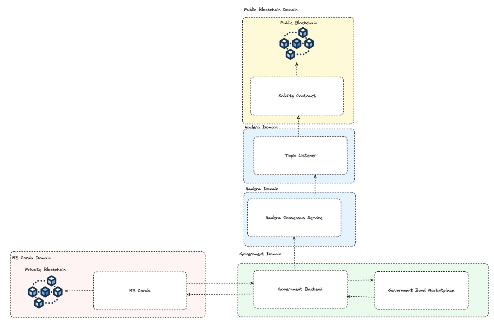

# Hello Future Hackaton Submission
- Category
  - Real World Asset (RWA) Tokenization.
- What did I create
  - An Application that allows users to buy government bonds. The government bonds are issued
as tokens on a private blockchain. Until... they are not! If the user wishes they can transfer 
this tokenized government bond to trade it in the secondary sales market.
- What's the benefit (Look at the slide deck for more info... 😉)
  - Fractional ownership
  - Global market access
  - Improved transparency and security

## Application Folder Structure
Please note: Each subdirectory has a README.md that guides you on how to get the application running.
- `/etherumBlockchain`
  - A project that includes a solidity contract that issues a government bond token on the etherum blockchain.
    - It also includes a hedera project that listens to a specific topic and initiates the solidity contract 
above when the topic receives a message.
- `/government_bond_marketplace`
  - This is the User Interface for the whole application
- `/governmentBackend`
  - This is a dummy government backend that has a list of government bonds that it returns to the user interface.
It is also responsible for talking to the R3 Corda application to issue, list and burn government bond tokens. 
It also interacts with Hadera consensus service by sending a message to a topic when a token is burnt.
- `/shinny-tokens`
  - This is an R3 Corda application that issues, lists and burn government bond tokens on a private ledger.
- `/ShinyTokenCustom`
  - This is a mock of the above. I faced many difficulties deploying the R3 Corda application, so I built out the
a mock application that essentially sends the same responses as the actual application.

## Architecture

### Components
- Government Bond Marketplace is the user interface (`/government_bond_marketplace`).
- Government Bond Backend is the application that tracks the bonds and talks to the corda application & Hadera Consensus Service (`/governmentBackend`). 
This partly includes the Hadera consensus service as it sends a message to the topic when a token is successfully burnt.
- R3 Corda, the actual implementation of this is on (`/shinny-tokens`) but after implementing the logic, I couldn't deploy it. So the live version is 
using the dummy version (`/ShinyTokenCustom`).
- Topic Listener is the file that listens to the topic and initiates the solidity contract (`/etherumBlockchain/hadera/subscribeTopic`).
- Solidity Contract is static & doesn't change as the contract has been deployed. It's code is stored in `/etherumBlockchain/eth`
